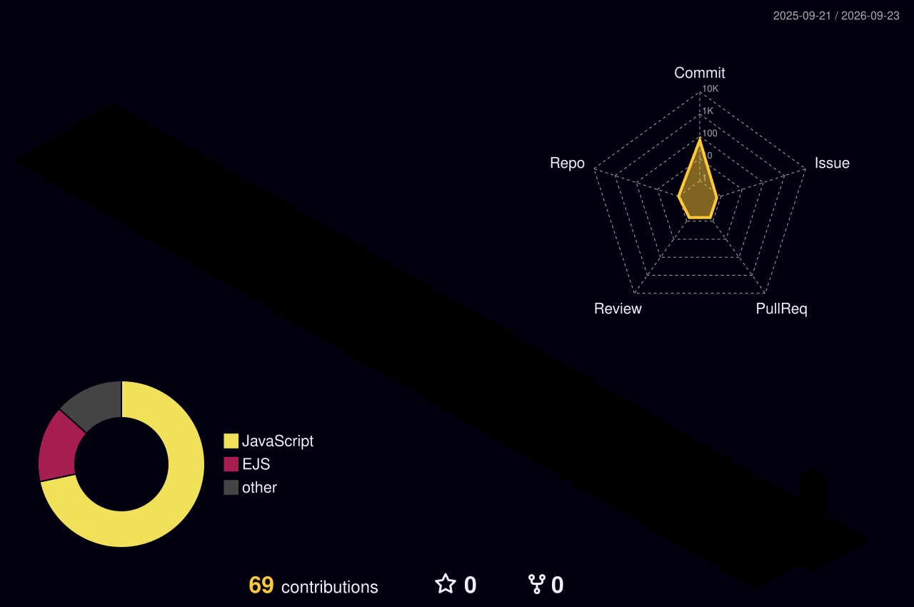

<div align="center">

```
╔══════════════════════════════════════════════════════════════════╗
║                                                                  ║
║                   ██████╗  █████╗ ██╗   ██╗███████╗███╗   ██╗  ║
║                   ██╔══██╗██╔══██╗██║   ██║██╔════╝████╗  ██║  ║
║                   ██████╔╝███████║██║   ██║█████╗  ██╔██╗ ██║  ║
║                   ██╔══██╗██╔══██║╚██╗ ██╔╝██╔══╝  ██║╚██╗██║  ║
║                   ██║  ██║██║  ██║ ╚████╔╝ ███████╗██║ ╚████║  ║
║                   ╚═╝  ╚═╝╚═╝  ╚═╝  ╚═══╝  ╚══════╝╚═╝  ╚═══╝  ║
║                                                                  ║
║                   System Architect & Automation Engineer        ║
║                                                                  ║
╚══════════════════════════════════════════════════════════════════╝
```

### *Building ideas into software*

```
Automation • APIs • Systems
Learning • Building • Improving  
Turning code into something useful
```

---

[](https://github.com/adixlucifer0011)
[](https://github.com/adixlucifer0011)

[**View Main Project →**](https://github.com/adixlucifer0011/DC-Bot) | [**GitHub Profile →**](https://github.com/adixlucifer0011)

---

</div>

## ◆ About

I'm a developer passionate about solving problems through code. My focus is on building automation systems, working with APIs, and crafting backend solutions that work reliably. I experiment with different technologies to understand how things work, and I'm driven by the satisfaction of turning ideas into functional software.

I work primarily with **JavaScript** and **Python**, leveraging **Node.js** for server-side development. Whether it's systems automation or API integration, I enjoy the challenge of building practical, efficient solutions.

---

## ◆ Technology Stack

<div align="center">

| **Languages** | **Runtime** | **Tools** |
|:---:|:---:|:---:|
|  |  |  |
|  |  |  |
|  | | |

</div>

---

## ◆ Featured Project

<div align="center">

### **DC-Bot** — Discord Automation & Voice Alerts

A modular Discord bot framework built with Node.js featuring voice state tracking, mass messaging capabilities, and an extensible command/event architecture.

**Core Features:**
- 🔊 Automated voice join/leave/switch alerts
- 📨 Owner-restricted mass DM functionality  
- ⚙️ Modular command and event system
- 🎵 Music playback hooks and helpers
- ✅ Slash command deployment pipeline

**Tech Stack:** JavaScript, Node.js, discord.js API, Modular Architecture

**Repository:** [adixlucifer0011/DC-Bot](https://github.com/adixlucifer0011/DC-Bot)

</div>

---

## ◆ GitHub Statistics

<div align="center">


</div>

---

## ◆ Development Activity

<div align="center">

### Contribution Graph


### 3D Contribution Visualization



</div>

---

## ◆ Current Focus

```
→ Deepening knowledge of backend systems architecture
→ Exploring advanced API design patterns
→ Expanding automation capabilities across tools
→ Building projects that solve real problems
```

---

## ◆ Developer Mindset

**Code is a craft.** Quality matters. Clean architecture matters. Understanding the 'why' behind a solution is as important as writing it. I believe in building systems that are maintainable, scalable, and genuinely useful — not just technically correct.

**Continuous learning is essential.** Technology evolves. Problems change. The best developers stay curious and adapt.

---

<div align="center">

### *Turning complexity into clarity through code*

[](https://github.com/adixlucifer0011)

<sub>Last updated: 2026-08-30 | Powered by automation</sub>

</div>
